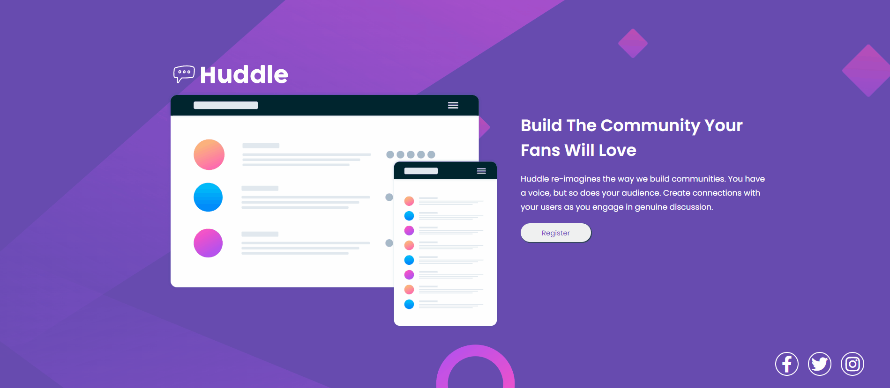

# Projeto Landing Page - Huddle

Aplicando conhecimentos adquiridos no curso DevQuest - Dev em dobro.

Este projeto conta com a criação de um layout responsivo para que possa ser aberto em qualquer aparelho, seja em telas grandes ou pequenas.
Algumas melhorias precisam ser feitas em relação ao clean code e já estou trabalhando nisso.

Confira meu trabalho abaixo:

## Tecnologias utilizadas:

- HTML
- CSS
